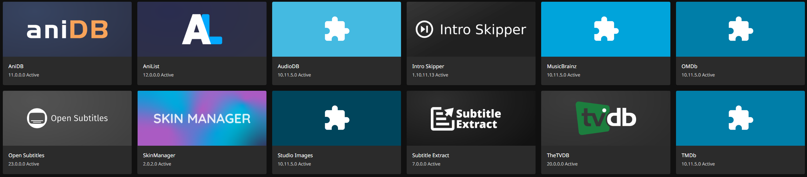
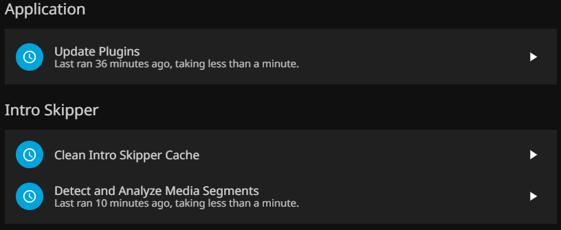

## Jellyfin: Breaking-up from streaming services

  

Jellyfin is an open source media system that allows me to be in control when managing and streaming my media. An alternative to stables such as Emby and Plex. Jellyfin does descend from Emby's 3.5.2 release so it bears some similarities to it.

I personally chose Jellyfin because it was a free software that was transparent about its development and its reason for existence. In an age of streaming service and subscription based models, the feeling of ownership is constanly fleeting away. I remember seeing Coraline be removed from Netflix and feeling such dispair knowing that I felt reliant on Netflix for all my media consuption.

---

## Setup

I set up my Jellyfin through the command line using the docummentation the folks provide on the Jellyfin website <a href="https://jellyfin.org/"> Jellyfin Offical Homepage</a>

I orginally had mounted my external HDD to be be the main storage for the media files, editing the /etc/fstab file to allow automatic mounting incase the server went down, however, with time the HDD began to fail and reading rates were poor so it was bad decision.

With my NAS "Magi", I was able to mount that storage to my server, which allows for roughly 7.8 TB of storage.
Like the HDD, I edited the /etc/fstab file to make sure the mounts are permanent, this way if the server goes down for restarts I won't have to manually mount those drives again.

In the Jellyfin "partition" of my NAS I have 1 main folder, and 4 different subfolders:
    - jellyfin_media
        - tv_shows
        - movies
        - anime_tv
        - anime_movies
    

Only the "jellyfin_media" folder had to be mounted for Jellyfin's access to the media. This is how a bit of the /etc/fstab/ file looked like

With this completed, the Jellyfin service would be able to continuously load and update whenever new media was added.

Inside of Jellyfin Dashboard, we're able to continue the set-up
I made an admin account "angelgonzo", and a user account "user"
    As to not use accidently delete something
Scanned mount points for media
    Jellyfin scans the path given to it and tries to get the metadata, subtiles, and any other info you might need to play the file 
    

    
Plugins
    Jellyfin offers plugins to further expand your media viewing experience, I chose a couple such as IntroSkipper to add QOL changes, nothing too major.
    

Automated Tasks
    I set up automated tasks for the plugins: everyday scan the metadata so IntroSkipper knows where the intro starts and finishes, download subtiles everyday, refresh metadata

---

## Usage
Like I said earlier, this service is mainly used to play media files, .mkv, as this was the best suited for quality, and device compatibility. 

A lot of the media I have on this has been media that I've collected over the years, along side my parents, and my friends copies of them.

Sure, my collection is not as expansive as Netflix or Hulu, but the collection is mine and it won't be going anywhere anytime soon, nor do I have to pay a monthly subscription for it, which is wonderful.

## Feedback
I do think Jellyfin was a good service to have when I was starting off my lab journey. It was easy to implement and configuration wasn't difficult at all. I think this is a perfect entry way to understand the basics of deploying services across a network, and it's what led me to pursue systems administration.

Aside from that, I do have teeny weeny issues with it:
    - Lack of official apps
        - Jellyfin has an official application/software that can be downloaded on various devices, however, not on all device such as a AppleTV (lol, I know this is such a niche complaint but it matters to me)
    - Customization options are not the best
        - Though this doesn't bother me as much, I do find the lack of UI customization strange, however, in the most recent update they allowed for CSS to be used to customize the UI. I will not be using this as I don't know CSS (LOL) but it's a nice change. There is a "Skin" Plugin but that chopping on my end and it never applies the "skin" properly so the UI is wonky.    

